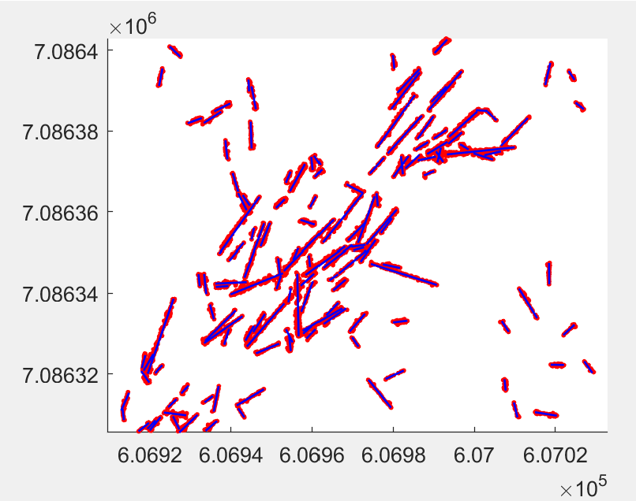

Fallen Tree Detection
====================================

This repository contains the source code for the ALS-based fallen tree detection algorithm developed by [Heinaro et al. 2021](https://www.sciencedirect.com/science/article/pii/S0378112721003133). The algorithm is used via the function `findFallenTrees()` that is located in `main\findFallenTrees.m`. 

Check the function documentation for a more detailed description of the inputs, outputs and usage of the function. 

**NOTE:** *The script `startup.m` must be called before running the function, as it adds all the required filepaths to the MATLAB path.*


Algorithm
--------------------------------

The fallen tree detection algorithm consists of four steps:

1. Reading and preprocessing the data
2. Filtering the point cloud using classification based on connected 
component analysis
3. Detecting fallen trees using iterative Hough transform -based line 
detection
4. Removing false fallen tree segments using a convolutional neural network

Steps 2 and 4 are optional. By default, the function `findFallenTrees()` performs step 2 using a default classifier that can be found in the folder `trained_classifiers\`, whereas step 4 is not performed. Steps 2 and 4 can use user-defined classifiers trained using the functions found in the folders `connected_component_training\` (step 2) and `final_classifier_training\` (step 4).


Example
--------------------------------
A short example of the function can be found under `example\exampleUsage.m`. It contains all necessary steps, including the call to `startup.m`. Paths are relative, execute the script from it's folder.




Prerequisites / Installation
--------------------------------

The repository contains all files to run a basic example or use the code on your own data.

MATLAB is required with the following add-ons (the last 3 are optional):

| Name										| Version	| PN	| Certain	|
|:------------------------------------------|:----------|------:|:---------:|
|MATLAB 									| 9.7 		| 1 	| true		|
|System Identification Toolbox				| 9.11 		| 4 	| true		|
|Signal Processing Toolbox					| 8.3 		| 8 	| true		|
|Mapping Toolbox 							| 4.9 		| 11 	| true		|
|Deep Learning Toolbox 						| 13.0 		| 12 	| true		|
|Image Processing Toolbox 					| 11.0 		| 17 	| true		|
|Statistics and Machine Learning Toolbox	| 11.6 		| 19 	| true		|
|Parallel Computing Toolbox					| 7.1 		| 80 	| false		|
|MATLAB Parallel Server 					| 7.1 		| 94 	| false		|
|Polyspace Bug Finder						| 3.1 		| 164 	| false		|

You can check whether all prerequisites are met by running the following code from the base directory of the repository:

```MATLAB
files = dir('**\*.m');
fullfile = strcat( extractfield(files,'folder')', {'\'}, extractfield(files,'name')');
[requiredFiles, requiredProducts] = matlab.codetools.requiredFilesAndProducts(fullfile);
```

`requiredProducts` will contain a complete list of the above mentioned toolboxes if they are installed (missing add-ons won't be listed by `matlab.codetools.requiredFilesAndProducts(fullfile)` and may cause unexpected error when running this code).

Due to it's extensive use of MATLAB Toolboxes, the script is *unlikely* to run out-of-the-box in Octave environments.
